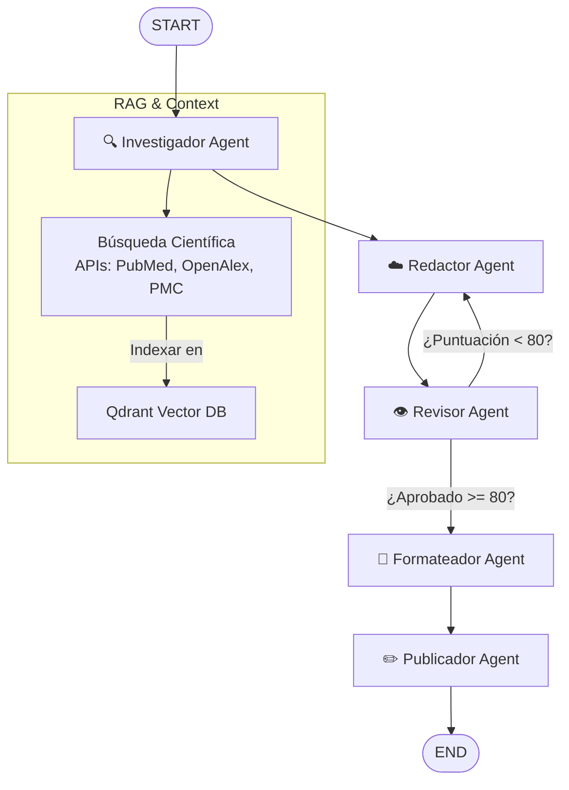

# Backend — AlexandrIA Magazine

Backend FastAPI con arquitectura modular, pipeline de agentes IA orquestado con **LangGraph**, RAG con **Qdrant** y modelos locales vía **Ollama**.

---

## Estructura de carpetas

```
backend/
├── app/
│   ├── main.py                  # Entrada FastAPI, lifespan, routers
│   ├── database.py              # Engine SQLAlchemy, get_session, init_db
│   ├── models.py                # Modelos ORM (SQLAlchemy) + DTOs (Pydantic)
│   │
│   ├── core/
│   │   ├── config.py            # Settings (config.yaml + env vars)
│   │   └── security.py          # JWT, bcrypt, hash_password, verify_token
│   │
│   ├── shared/
│   │   └── database.py          # AsyncSessionLocal (para agentes)
│   │
│   ├── agents/                  # Pipeline multi-agente con LangGraph
│   │   ├── investigador.py      # Busca contexto en Qdrant RAG + APIs científicas
│   │   ├── redactor.py          # Genera borrador científico con Ollama
│   │   ├── revisor.py           # Evalúa el borrador (score 0-100) con Ollama
│   │   ├── formateador.py       # Aplica formato APA / IEEE / Vancouver
│   │   ├── publicador.py        # Actualiza artículo a PUBLISHED en DB
│   │   └── orquestador.py       # StateGraph LangGraph + logging a DB
│   │
│   └── routers/
│       ├── auth.py              # Registro, login, /me, promote-reviewer
│       ├── articles.py          # CRUD artículos + submit / approve / reject
│       ├── ai.py                # RAG ingest, AI assist, listar modelos Ollama
│       └── agents.py            # Ejecutar pipeline, historial de runs
│
├── tests/
│   └── test_auth_end_to_end.py  # Test E2E de autenticación
│
├── requirements.txt
├── Dockerfile
└── .env.example
```

---

## Pipeline de agentes IA (LangGraph)

El pipeline se orquesta dinámicamente según la `flow_sequence` solicitada. El flujo estándar completo es:

```
START → Investigador → Redactor → Revisor → Formateador → Publicador → END
```

### Diagrama de flujo



### Descripción de cada agente

| Agente | Responsabilidad |
|---|---|
| **Investigador** | Consulta Qdrant (RAG local) y APIs científicas públicas (EuropePMC, OpenAlex) para obtener contexto y fuentes reales |
| **Redactor** | Genera un borrador académico en Markdown usando Ollama (`llama3.2`), incorporando el contexto de investigación y el feedback previo del Revisor |
| **Revisor** | Evalúa el borrador con Ollama, devuelve una puntuación (0-100) y comentarios. Si `score < 80` y `loops < 3`, reenvía al Redactor |
| **Formateador** | Reformatea las citas y referencias según el estilo solicitado: **APA**, **IEEE** o **Vancouver** |
| **Publicador** | Escribe el texto final en la DB, cambia el estado del artículo a `PUBLISHED` y genera la URL de publicación |

### Estado compartido entre agentes (`AgentState`)

```python
class AgentState(TypedDict):
    article_id: UUID
    author_id: UUID
    title: str
    keywords: list[str]
    research_data: str       # Contexto del Investigador
    sources: list[dict]      # Fuentes científicas encontradas
    draft_text: str          # Borrador generado por el Redactor
    feedback: list[str]      # Comentarios del Revisor
    approval_score: float    # Puntuación del Revisor (0-100)
    formatted_text: str      # Texto formateado por el Formateador
    scientific_format: str   # "apa" | "ieee" | "vancouver"
    published_url: str       # URL final de publicación
    flow_sequence: list[str] # Secuencia de nodos a ejecutar
    loop_count: int          # Iteraciones del bucle Revisor → Redactor
```

Cada ejecución de agente se registra en la tabla `agent_runs` para trazabilidad completa.

---

## Endpoints

### Auth
| Método | Ruta | Descripción |
|---|---|---|
| `POST` | `/api/v1/auth/register` | Registro de nuevo usuario |
| `POST` | `/api/v1/auth/login` | Login, devuelve JWT |
| `GET` | `/api/v1/auth/me` | Datos del usuario autenticado |
| `POST` | `/api/v1/auth/dev/promote-reviewer` | Promocionar a reviewer (solo DEBUG) |

### Articles
| Método | Ruta | Descripción |
|---|---|---|
| `GET` | `/api/v1/articles` | Listar artículos del autor autenticado |
| `POST` | `/api/v1/articles` | Crear borrador |
| `GET` | `/api/v1/articles/{id}` | Obtener artículo por ID |
| `PUT` | `/api/v1/articles/{id}` | Actualizar artículo |
| `POST` | `/api/v1/articles/{id}/submit` | Enviar a revisión |
| `POST` | `/api/v1/articles/{id}/approve` | Aprobar artículo (reviewer) |
| `POST` | `/api/v1/articles/{id}/reject` | Rechazar artículo (reviewer) |

### AI / RAG
| Método | Ruta | Descripción |
|---|---|---|
| `POST` | `/api/v1/ai/ingest` | Indexar texto en Qdrant (RAG) |
| `POST` | `/api/v1/ai/assist` | Asistencia IA sobre un artículo |
| `GET` | `/api/v1/ai/models` | Listar modelos disponibles en Ollama |

### Agentes IA
| Método | Ruta | Descripción |
|---|---|---|
| `POST` | `/api/v1/agents/{article_id}/run` | Ejecutar pipeline de agentes |
| `GET` | `/api/v1/agents/{article_id}/runs` | Historial de ejecuciones del artículo |

#### Ejemplo de llamada al pipeline

```bash
curl -X POST http://localhost:8000/api/v1/agents/{article_id}/run \
  -H "Authorization: Bearer <token>" \
  -H "Content-Type: application/json" \
  -d '{
    "flow_sequence": ["investigador", "redactor", "revisor", "formateador", "publicador"]
  }'
```

#### Respuesta

```json
{
  "status": "completed",
  "published_url": "http://localhost:8080/articles/{id}/view",
  "feedback": [],
  "approval_score": 92.0,
  "word_count": 1450
}
```

### Health
| Método | Ruta | Descripción |
|---|---|---|
| `GET` | `/health` | Estado del servicio |

---

## Ejecutar en local (sin Docker)

```bash
cd backend
python -m venv .venv
.venv\Scripts\activate        # Windows
# source .venv/bin/activate   # Linux / macOS
pip install -r requirements.txt
uvicorn app.main:app --reload --port 8000
```

Documentación interactiva disponible en: **http://localhost:8000/docs**

## Ejecutar con Docker Compose

Desde la raíz del proyecto:

```bash
docker compose up --build
```

---

## Configuración

El backend carga configuración desde `config.yaml` (raíz del repo). En Docker se monta en `/app/config.yaml`.

**Prioridad:**
1. Variables de entorno (`ENV`)
2. `config.yaml`
3. Defaults en `app/core/config.py`

### Variables principales

| Variable | Default | Descripción |
|---|---|---|
| `DATABASE_URL` | `postgresql+asyncpg://...` | URL de la base de datos |
| `SECRET_KEY` | `your-secret-key` | Clave para firmar JWT |
| `OLLAMA_BASE_URL` | `http://localhost:11434` | URL de Ollama |
| `OLLAMA_MODEL` | `llama3.2` | Modelo LLM a usar |
| `QDRANT_URL` | `http://localhost:6333` | URL de Qdrant |
| `QDRANT_COLLECTION` | `rag_docs` | Colección vectorial RAG |

---

## Tests

```bash
cd backend
python -m pytest tests/ -v
```

El test E2E de autenticación cubre: registro → obtener usuario autenticado → login → verificar nuevo token.

---

## Servicios del stack completo

| Servicio | URL |
|---|---|
| API FastAPI | http://localhost:8000 |
| Docs OpenAPI | http://localhost:8000/docs |
| Frontend | http://localhost:8080 |
| Ollama | http://localhost:11434 |
| Qdrant Dashboard | http://localhost:6333/dashboard |
